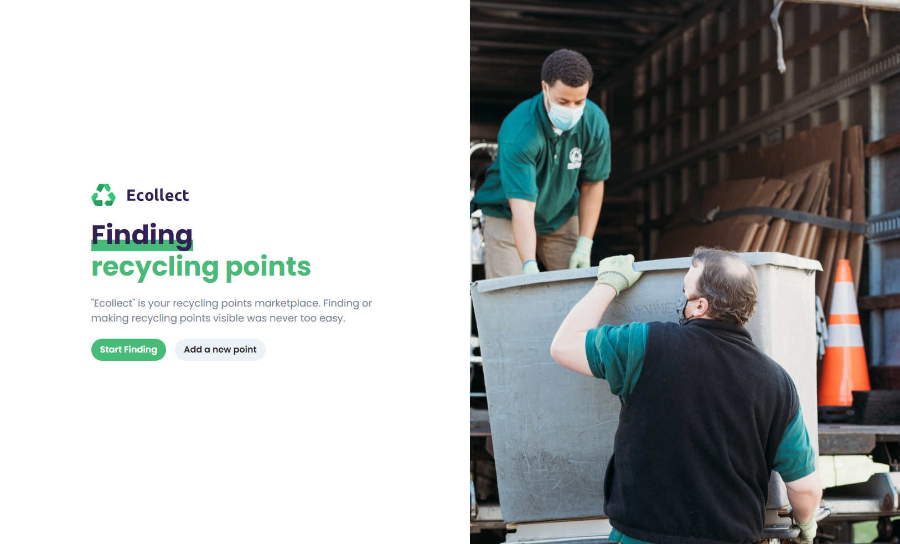

<h1 align="center">
    
</h1>

<h1 align="center">
    
</h1>

<h2 align="center">Live Demo: https://ecollect.gabrielnbds.dev </h2>

## 💻 Project

Ecollect is a marketplace that helps people to find recycling points efficiently.

## 🚀 Techs

This project was built with:

- [React](https://reactjs.org)
- [Next](https://nextjs.org/)
- [Firebase](https://firebase.google.com/)
- [Chakra UI](https://chakra-ui.com/)
- [Google Maps](https://developers.google.com/maps)
